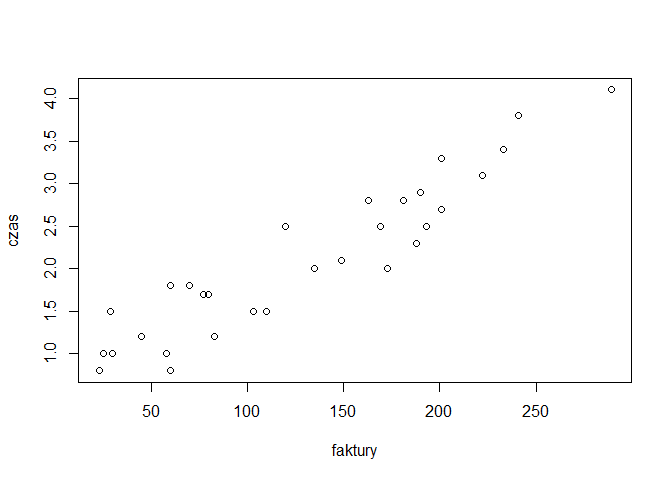
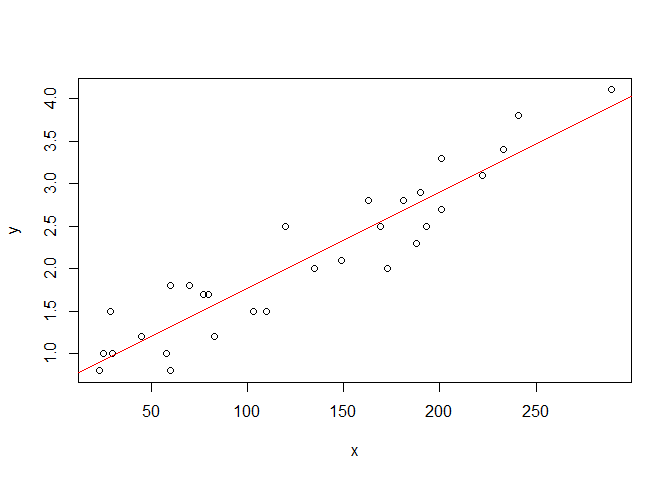

### Kilka słów o danych

Kierownik działu zaopatrzenia pewnej dużej firmy zamierza opracować
model regresji pozwalający przewidywać średni czas wystawiania i
wysyłania określonej liczby faktur. W ciągu miesiąca zbierał codzienne
dane o czasie (w godzinach) poświęconym na ich wysłanie.

Plan działań:

1.  Wstępnie przejrzeć dane w celu zbadania czy występuje zależność
    liniowa.
2.  Obliczyć parametry β0 i β1 metodą najmniejszych kwadratów i Zbudować
    na ich podstawie model liniowy.
3.  Znaleźć 95% przedział ufności dla parametrów β0 i β1.
4.  Znaleźć 95% przedziały ufności dla predykcji czasu wystawienia 130
    faktur.
5.  Przetestować hipotezę H0: β1=0.01 i zinterpretować wynik.
6.  Przetestować hipotezę H0: β1=0.013 i zinterpretować wynik.

### 1. Wstępne przejrzenie danych

``` r
faktury <- read.table("faktury.txt", header=T)
head(faktury)
```

    ##   Dzien Faktury Czas
    ## 1     1     149  2.1
    ## 2     2      60  1.8
    ## 3     3     188  2.3
    ## 4     4      23  0.8
    ## 5     5     201  2.7
    ## 6     6      58  1.0

``` r
x <- faktury$Faktury
y <- faktury$Czas
plot(x, y, xlab="faktury", ylab="czas")
```



### 2. Obliczenie parametrów β0 i β1 metodą najmniejszych kwadratów

``` r
SXX <- sum( (x-mean(x)) ^ 2 )
SXY <- sum( (x-mean(x)) * (y-mean(y)) )
b1 <- SXY / SXX
b0 <- mean(y) - b1 * mean(x)
plot(x,y)
abline(a=b0, b=b1, col="red")
```



Parametr β1 wynosi 0.0112916, zaś parametr β0 - 0.6417099.

### 3. Przedziały ufności dla β0 i β1

``` r
# Średni błąd kwadratowy
s2 <- sum( (y - (b1 * x + b0)) ^ 2)

# Błędy standardowe dla parametrów b0 i b1
SE.b1 <- sqrt( s2 / SXX )
SE.b0 <- sqrt( s2 * (mean(x) ^ 2 ) / (SXX * length(x)) )
```

Błędy standardowe dla parametrów b0 i b1 wyniosły odpowiednio 0.102811 i
0.0043306.

Obliczymy teraz statystykę t dla tych parametrów.

``` r
t.b1 <- b1 / SE.b1
t.b0 <- b1 / SE.b0
t.b1
```

    ## [1] 2.607423

``` r
t.b0
```

    ## [1] 0.1098291

Sprawdzimy jaką wartość przyjmuje t przy poziomie istotności 0.95
Skorzystamy z wbudowanej funkcji qt(poziom istot., liczba st. swob.)

``` r
qt(1-0.05, length(x)-2)
```

    ## [1] 1.701131

#### Interpretacja

Statystyka t dla parametru β1 (t=2.6074229) jest poza obszarem poziomu
istotności. Musimy zatem odrzucić H0: b1 = 0. Oznacza to, że zmienne
mają związek liniowy. Natomiast w przypadku parametru b0 (t=0.1098291),
musimy przyjąć H0: β0 = 0. Ocznacza to, ze parametr b0 jest nieistotny.

Wyznaczymy w takim razie przedziały ufności dla parametrów β0 i β1 przy
tym samym poziomie istotności 0.95.

``` r
b1.lewy <- b1 - qt(1-0.05/2, length(x)) * SE.b1
b1.prawy <- b1 + qt(1-0.05/2, length(x)) * SE.b1
b1.lewy
```

    ## [1] 0.002447427

``` r
b1.prawy
```

    ## [1] 0.02013586

``` r
b0.lewy <- b0 - qt(1-0.05/2, length(x)) * SE.b0
b0.prawy <- b0 + qt(1-0.05/2, length(x)) * SE.b0
b0.lewy
```

    ## [1] 0.4317417

``` r
b0.prawy
```

    ## [1] 0.851678

#### Interpretacja

jeśli β1 znajdzie się poza zakresem \[ 0.0024474, 0.0201359\], to z
prawdopodobieństwem błędu 0.05 możemy odrzucić H0. W przeciwnym razie
nie ma podstaw do odrzucenia H0 i występuje zależność liniowa.
Analogicznie, jeśli β0 znajdzie się poza zakresem \[ 0.4317417,
0.851678\], to z prawdopodobieństwem błędu 0.05 możemy odrzucić H0. W
przeciwnym razie nie ma podstaw do odrzucenia H0 i czynnik β0 jest
istotny.

### 4. Przedziały ufności dla predykcji czasu wystawienia 130 faktur

Problem polega na wyznaczeniu przedziałów ufności dla wartości
oczekiwanej Y przy ustalonej wartości X.

``` r
f_130.lewy <- b0 + b1 * 130 - qt(1-0.05/2, length(x)) * sqrt(s2) * sqrt (1 + 1/length(x) + ((130- mean(x))^2) / SXX )
f_130.prawy <-b0 + b1 * 130 + qt(1-0.05/2, length(x)) * sqrt(s2) * sqrt (1 + 1/length(x) + ((130- mean(x))^2) / SXX )
f_130.lewy
```

    ## [1] -1.513044

``` r
f_130.prawy
```

    ## [1] 5.732291

#### Interpretacja

Otrzymane wyniki mówią, iż gdy czas wystawienia 130 faktur wynikający z
predykcji modelu znajdzie się poza przedziałem \[-1.5130437,
5.7322909\], to z pr-stwem błędu 0.05 możemy odrzucić H0. W przeciwnym
razie nie ma podstaw do odrzucenia H0, czyli predykcja modelu jest
dobra.

Oczywiście, dolna wartość przedziału jest bez sensu, bo czas wystawienia
faktur nie może być ujemny. Zakładamy więc, że 0.95 przedział ufności
wynosi \[0, 5.7322909\].
